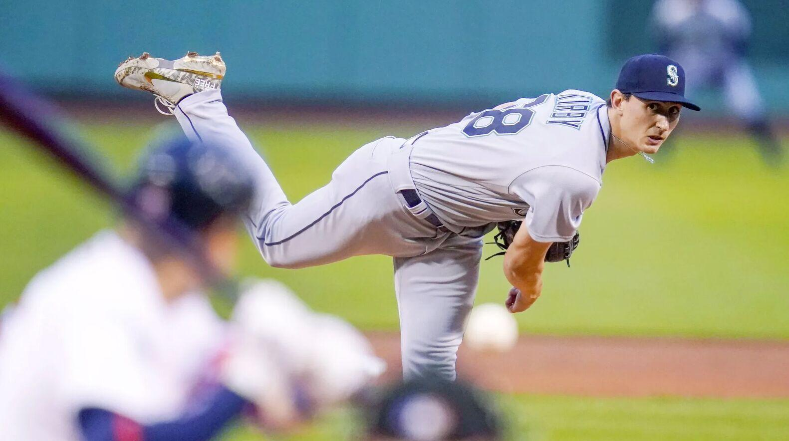

## [Learn About Me](/aboutme.md)

## Project Portfolio

### [Quality of Location - developing a new pitch metric](https://drose1988.github.io/pitch_location_quality_project/)

The Winning Playbook is an insightful analysis to explore the performance of NBA teams during the 2021-2022 season. We'll use Tableau to visualize & explore the performance of different basketball teams, and players in a variety of factors, including wins and losses, offensive and defensive efficiency, and individual players' statistics on having the most assists at different positions.
---
[Project 2 Title](/pdf/sample_presentation.pdf)

---
[Project 3 Title](http://example.com/)

---

### Category Name 2

- [Project 1 Title](http://example.com/)
- [Project 2 Title](http://example.com/)
- [Project 3 Title](http://example.com/)
- [Project 4 Title](http://example.com/)
- [Project 5 Title](http://example.com/)

---

---

Page template forked from <a href="https://github.com/evanca/quick-portfolio">evanca</a>

<!-- Remove above link if you don't want to attibute -->
